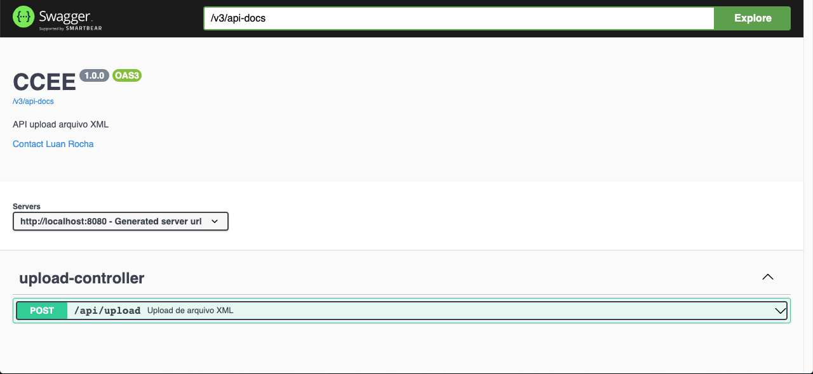

# PROJETO UPLOAD DE ARQUIVOS .XML
Projeto cliente e servidor para upload de aquivos .xml

## Tecnologias
- Java 11
- Angular 14
- Spring Boot
- Swagger
- Docker
- Arquitetura Hexagonal
- Maven
- NPM
- NodeJS


### Efetuar o build do back-end
acessar a pasta ./back
```shell script
$ ./mvnw install
$ ./mvnw package
```

### Efetuar o build do front-end
acessar a pasta ./front
```shell script
$ npm run build
```

### Passos para o funcionamento local
back-end será executada na porta **8080**.<br>
Front-end será executado na porta **4200**.

<br>

na pasta ./back
```shell script
$ ./mvnw spring-boot:run                          
```
na pasta ./front
```shell script
$ npm start
```

<br>

### Passos para o funcionamento local - aplicação back com com docker
Back-end (API) será executada na porta **8080**.<br>
Front-end será executado na porta **4200**.

<br>

na pasta ./back
```shell script
$ docker-compose up
```

na pasta ./front
```shell script
$ npm start
```

<br>

### Documentação da API
A aplicação foi documentada com Swagger
```shell script
http://localhost:8080/swagger-ui/index.html
```

#### Tela do swagger


<br>

#### Tela do front


<br>

#### Pipeline Build e Validação dos testes CI
Contrução do CI com git action
[LINK](https://github.com/Luancarlos/upload-arquivos/actions)

<br>

#### Arquitetura Hexagonal
o back-end foi construido com a arquitetura hexagonal


